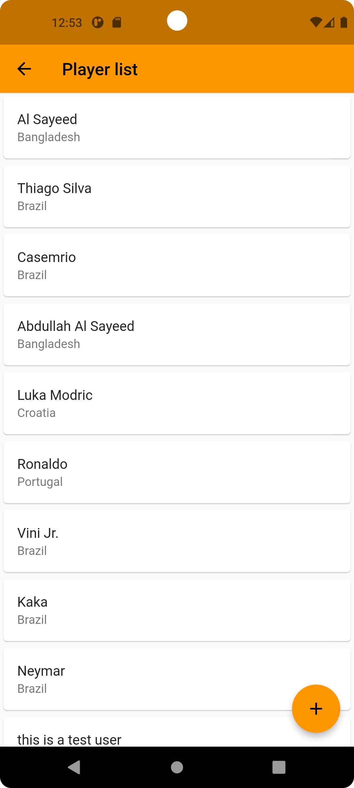
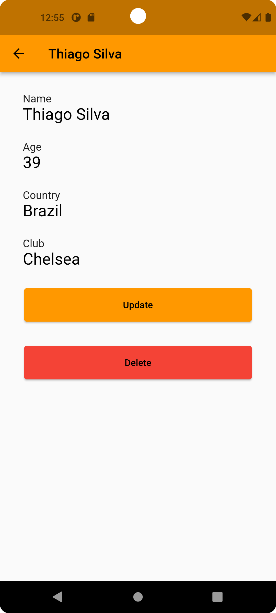
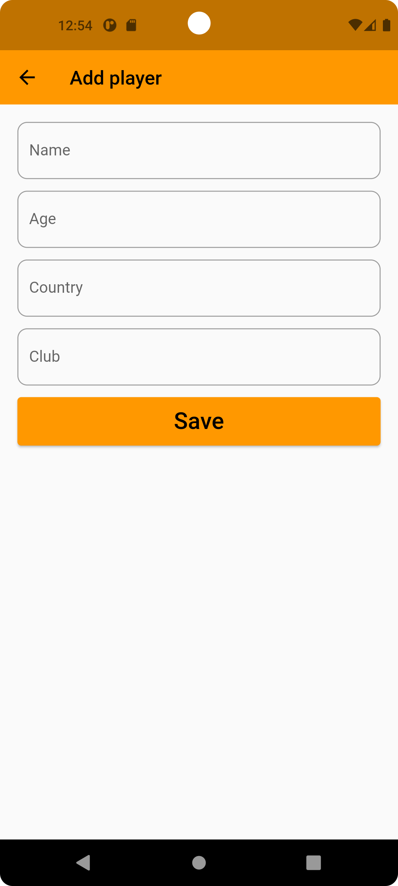
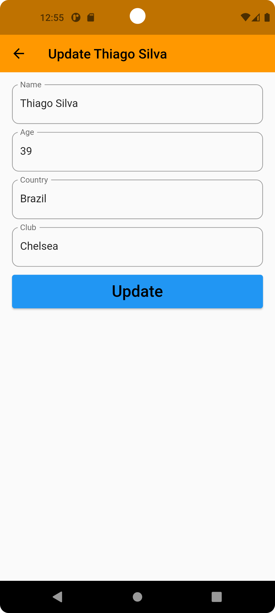

# Flutter firebase 0.1

### A simple application where firebase is integraded and CRUD functionality implemented using firestore database.

The Homepage will display a list of players fetched from firestore database. User can click on a player to see more details of the player, update any info, or delete the player from cloud database. And ofcourse he/she can add new player, the floating action button is right below in the player list screen.

<hr>

## Showcase

<table>
  <tr>
    <td>Player list</td>
    <td>Player info</td>
  </tr>

  <tr>
    <td></td>
    <td></td>
  </tr>

  <tr>
    <td>Add Player</td>
    <td>Update Player</td>
  </tr>
  <tr>
    <td></td>
    <td></td>
  </tr>

 </table>
<br/>

## Stacks

- Dart
- Flutter
- Firebase

<br/>

## Topics

2. Firebase
3. Firestore


<br/>

## Useful commands

1. Generate SHA-1(ubuntu)
```
keytool -list -v -keystore ~/.android/debug.keystore -alias androiddebugkey -storepass android -keypass android
```

## Topics to have a look
1. FutureBuilder
2. StreamBuilder
3. Firestore
